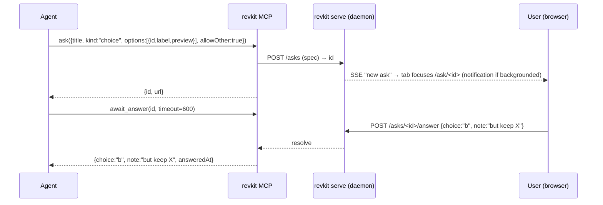
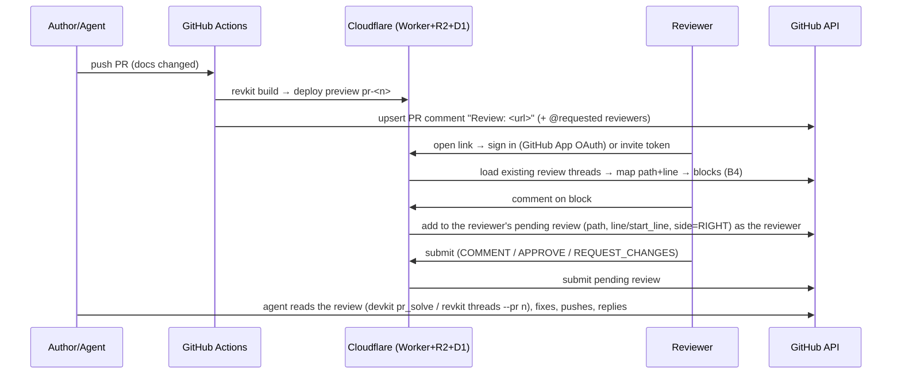

# DESIGN-0001 — revkit architecture

| | |
|---|---|
| Status | Accepted 2026-09-29 (ADR-0001 – ADR-0024; ADR-0023 deferred) |
| Issue | [#3](https://github.com/vig-os/revkit/issues/3) |
| Date | 2026-09-29 |
| Decisions | [ADR-0001 – ADR-0011](../adr/README.md) · traceability: [FEATURE-MATRIX](../FEATURE-MATRIX.md) |
| Agreed in discussion (ADRs pending acceptance) | Starlight shell · Solid islands · self-minted invite links (Authentik later, [#4](https://github.com/vig-os/revkit/issues/4)) |

revkit is an HTML-first review surface for the agentic era. An agent authors structured documents (ADRs, designs,
reports, questions) from an **opinionated, guarded component set**; a human reads them rendered, comments inline, and
answers questions through richer UIs than chat. Those comments flow back to the agent, locally or as a real GitHub PR
review with file-and-line anchors.

It has two modes, which share one content model and one anchor model:

- **Local loop.** A single user on their own machine with an agent. The requirement is speed: sub-second from agent
  write to rendered page, and from human answer to agent input.
- **Hosted PR review.** CI builds a preview per PR and posts the link. Reviewers comment on the rendered doc, and the
  comments become PR review comments on the source lines.

## 1. User stories

**A — local agent loop**

| # | Story |
|---|---|
| A1 | As a user, when the agent needs a decision, I get a **question page** (choices with previews, ranking, sliders, free text, pick-a-region on a plot/diagram) instead of a chat prompt, and my answer reaches the agent in < 1 s |
| A2 | As a user, I **comment inline** on any block of a doc the agent wrote; comments persist across edits and rebuilds and reach the agent as structured input |
| A3 | As a user, I can **chat with the agent in a thread** anchored on a block ("why this number?") |
| A4 | As an agent, I **publish** a report (prose, math, plots, tables) and the page refreshes in < 1 s, without a full build |
| A5 | As a user, my comments reach the agent **live** (mid-turn, or while I'm away from the terminal), and I choose the cadence: live, on **handover** of a batch, or quiet |
| A6 | As a user, I **suggest an edit** on the rendered text; the agent (or I) accepts it and it lands in the source |
| A7 | *(later)* As a user, I **co-edit** the source next to the rendered view while the agent edits too, without conflicts |
| A8 | As a user, comments **never break on rebuild**: they re-anchor after edits, I can comment while a rebuild runs, and a comment whose text vanished is kept as *orphaned*, never lost |

**B — PR review**

| # | Story |
|---|---|
| B1 | As an author, when a PR touches docs, CI builds a preview and **posts the link** on the PR, pinging the requested reviewers |
| B2 | As a GitHub reviewer, I sign in with GitHub and comment on the rendered doc; each comment becomes a **PR review comment on the exact file + line**, as me |
| B3 | As a reviewer, I **submit the review** (comment / approve / request changes) from the page |
| B4 | As a reviewer, I see existing PR review threads **on the page** (two-way), resolved state included |
| B5 | As a non-GitHub reviewer, I open a **personal invite link**; my comments are attributed to me and mirrored to the PR |
| B6 | As an agent, I pick up the review (threads with anchors), fix the source, reply and resolve; the next preview re-anchors |
| B7 | *(M8)* As a reviewer, I review **code diffs** of a PR in revkit with the same comment rail, mapped to PR lines |

**C — authoring and consistency (guards)**

| # | Story |
|---|---|
| C1 | As a maintainer, agents can only use **registered components**; hand-rolled HTML/CSS/JS is blocked at pre-commit, with an **escalation path** that asks the user for a new component |
| C2 | Terms are **defined once** in a vocabulary; references to undefined terms fail, and redefinitions in prose are flagged |
| C3 | **Links** and **doc sets** are validated: no broken links, no orphans in a set, prev/next consistent |
| C4 | A plot is **spec + data side files**, never inline data or a hand-rolled chart |
| C5 | **LaTeX** math renders correctly, with no client JS |
| C6 | Proper **phone / tablet / desktop** layouts, with a left **"train line"** navigation for doc sets |

**D — distribution, E — performance**

| # | Story |
|---|---|
| D1 | Any repo adds revkit with **one flake input + one line**; devkit consumers opt in as a module |
| D2 | Each org hosts its own review site (Cloudflare), authenticated per GitHub org |
| E1 | Low memory/CPU: static HTML by default, JS only where interaction needs it; a lightweight daemon for the local loop |

## 2. Stack, and which stories each part covers

All choices below were checked (2026-09-29) and are active upstream. Sizes were **measured**: `bun build --minify`,
gzip -9, with the full library imported.

| Layer | Choice | Covers | Why |
|---|---|---|---|
| Runtime / package manager | **Bun** 1.3 (from the flake) | A4, E1 | One fast binary for install, scripts, tests, and the local daemon |
| Site framework | **Astro** 7 | A4, C3, C6, E1 | Static-first; islands ship JS only where used; content collections with schemas; Vite HMR in dev |
| Docs shell | **Starlight** 0.42 | C6, C3 | Responsive layout, sidebar, search (Pagefind, static), i18n. Built-in components (Aside, Tabs, Steps, Cards, FileTree, Badge, Code via Expressive Code) seed the component set |
| Islands | **Solid** 1.9 (4 KB gz) | A1–A3, B2–B4, E1 | Fine-grained reactivity with no VDOM, the lightest option for comment rails and question widgets |
| Primitives | **Kobalte** (accessible headless) + a styled layer ported from **shadcn-solid** into revkit's registry | C1 | Kobalte is the actively maintained base. shadcn-solid is copy-in source, so it is vendored **once** into revkit rather than taken as a dependency, and consumers import it, never copy it |
| Styling | Tailwind via `@astrojs/starlight-tailwind` | C1, C6 | One token set shared by Starlight and islands; no free-form CSS in content |
| Math | `remark-math` + `rehype-katex` | C5 | Rendered to HTML at build; only CSS and fonts ship |
| Plots | **Vega-Lite** spec (JSON) + side data file, rendered to **SVG at build** | C4, E1 | Measured at 53 ms per plot, 0 KB JS. The JSON schema makes the spec validatable and agent-safe (no code). Interactive mode is a lazy island (vega-embed, 291 KB gz), loaded only on click. uPlot (22 KB gz) is reserved for large time series |
| Links | `starlight-links-validator` + revkit set checks | C3 | Broken links fail the build; the set/orphan rules are ours |
| Local daemon | `revkit serve` on `Bun.serve` + SSE | A1–A3, E1 | Serves the built site plus a small JSON API; no Vite needed for asks/comments |
| Agent bridge | **MCP server** (`revkit mcp`) + a Claude Code skill | A1–A3, B6 | Tools: `ask`, `await_answer`, `threads`, `reply`, `resolve`, `publish` |
| Hosting | **Cloudflare Worker (static assets from R2) + D1 + Durable Objects** per org | B1–B5, D2 | Static preview per PR. The Worker handles auth, the thread API and the GitHub bridge; D1 stores threads and invites |
| GitHub bridge | **GitHub App**, user-to-server tokens | B2–B4 | Comments and reviews post **as the reviewer**, with real attribution and review requests |
| Guest auth | Self-minted invite links (v1), Authentik OIDC (later, #4) | B5 | See §6 |

On "lean enough": Solid islands (4 KB) plus build-time SVG plots and math mean a typical doc page ships **only the
comment-rail island**. Observable Plot (82 KB gz) also renders server-side and was considered. Vega-Lite wins because
its spec is **data, not code**, which is what the plot guard (C4) needs.

**Why not a pure JSON/nested-JSON document model?** JSON is used for everything that *is* data (plots, vocabulary,
question specs, threads). Prose stays in **MDX**. B2 and B6 need comments to land on **source lines** in the PR diff,
and a line in an MDX file is a reviewable, diffable unit; a node in a nested JSON tree is not. A JSON doc model would
also make GitHub's own diff view useless for the same docs.

**Rebuild speed.** No custom "subpage guard" is needed:

- In the local loop, Astro's dev server updates per file in well under a second. Question pages don't rebuild at all,
  because they are one prebuilt route rendering a JSON spec fetched from the daemon.
- CI builds the whole site, which takes seconds at doc-repo scale.
- If a large doc set ever makes CI builds slow, the content layer's cache plus a per-set build is the lever. Measure
  before building it.

## 3. Content model

```text
docs/                       # MDX prose, one file per page; frontmatter validated by a Zod schema
  adr/0003-storage.mdx
  sets/onboarding/…         # a "set" = ordered pages → train-line nav, prev/next, orphan check
vocab/terms.yaml            # collection: id, term, definition, aliases
plots/latency/spec.vl.json  # Vega-Lite spec, data.url → sibling file only
plots/latency/data.csv
asks/<id>.json              # question specs (local loop; gitignored unless kept for audit)
.revkit/threads/*.json      # local comment threads (hosted mode: D1)
```

Content uses components only from `@revkit/components`: `<Term id>`, `<Plot src>`, `<Decision>`, `<Question>`,
`<Callout>`, and the Starlight set.

## 4. Guards (pre-commit + build)

Everything below is **`revkit check`**, a single CLI shipped by the flake. It runs as prek hooks via the flake's
exported hook set (§7) and again at build, so CI and local agree.

| Guard | Rule | Escape |
|---|---|---|
| component-registry (C1) | MDX may import only from `@revkit/components`; no raw HTML elements, `<style>`, `<script>` or inline `style=` | `{/* revkit-allow: #<issue> */}`, which must reference an **open issue labeled `component-request`**. `revkit escalate "<need>"` files that issue, or in the local loop raises an `ask` to the user |
| vocabulary (C2) | `<Term id>` must exist; a bold-defined phrase (`**X** is/means …`) matching a vocab term or alias is flagged as a redefinition | Add to `vocab/terms.yaml` |
| links + sets (C3) | Links resolve; every page in a set is in its ordering; no orphans; prev/next derived, never hand-written | — |
| plot-structure (C4) | `<Plot>` must point to a `spec.vl.json` validating against the Vega-Lite schema; `data.values` (inline data) is forbidden; `data.url` must be a sibling file that exists | — |
| no-hand-rolled-UI (C1) | Repo-wide on the `src/` side: new `.astro`/`.tsx` components only under the registry package | Same escalation |

The generic halves (a registry-import guard for TS, TS stub patterns) are elevation candidates for devkit
([#1](https://github.com/vig-os/revkit/issues/1)).

## 5. Agent interaction

### 5.1 Rich question (A1)

`ask` returns immediately with an id and URL; `await_answer` long-polls. A single blocking tool call would hit
MCP/tool timeouts on a human-paced answer.



What the agent sees:

```jsonc
// agent → ask
{ "title": "Which storage backend?", "kind": "choice",
  "options": [
    { "id": "d1",  "label": "Cloudflare D1", "preview": "plots/latency/spec.vl.json" },
    { "id": "kv",  "label": "Workers KV" } ],
  "allowOther": true }
// ← await_answer
{ "choice": "d1", "note": "only if threads stay < 1 MB per PR" }
```

Question kinds (v1): `choice` (single/multi, previews rendered with the full component set), `rank`, `scale`, `text`,
`region` (click/brush on a plot or diagram, returning data coordinates), and `review` (approve/revise a rendered doc).
An optional Claude Code **PreToolUse hook** on `AskUserQuestion` can suggest `revkit ask` when the daemon is running
and the question has previews. It is opt-in, never a silent redirect.

### 5.2 Inline comments and threads (A2, A3)

Every rendered block carries `data-src="<file>#L<start>-L<end>"`, injected by a rehype plugin from the MDX AST
positions. A comment stores a **dual anchor**: the source range plus a text-quote selector (W3C Web Annotation style:
exact + prefix/suffix), so it re-anchors after edits and marks itself *orphaned* when the quote can't be re-found
(§5.4).

```mermaid
sequenceDiagram
  participant U as User
  participant D as daemon
  participant Ag as Agent
  U->>D: comment on block docs/adr/0003.mdx#L40-L44 ("why 30s?")
  D-->>Ag: (next turn) hook injects "1 open thread" / or Ag polls threads()
  Ag->>D: threads({status:"open"}) → [{id, anchor, quote, body}]
  Ag->>Ag: edit docs/adr/0003.mdx
  D-->>U: HMR / SSE re-render, thread re-anchored
  Ag->>D: reply(id, "raised to 60s, see L42") ; resolve(id)
```

Threads reach the agent in two ways:

- **Pull:** MCP `threads()`, or `revkit threads --json` from Bash.
- **Push:** a `UserPromptSubmit` hook that prepends "N new review comments" when there are unread threads, so the
  agent never has to be told to check.

### 5.3 Live delivery, handover and presence (A5)

"Next turn" isn't good enough. The daemon exposes **one event stream** (`/events`, WebSocket + SSE), and three
transports put it into the agent session, best first. Checked against the Claude Code docs on 2026-09-29:

| Transport | Mid-turn | While you're away (session open) | Setup |
|---|---|---|---|
| **Channel.** `revkit mcp` declares the `claude/channel` capability; events arrive as `<channel source="revkit">`, and the agent answers through the channel's `reply` tool, so the reply appears live in the thread | yes, between tool calls | yes | Research preview. `claude --channels plugin:revkit@<marketplace>` needs the plugin on an allowlist (the org's `allowedChannelPlugins`, i.e. a vig-os marketplace: vig-os/devkit#1765, vig-os/devkit#927); until then `--dangerously-load-development-channels server:revkit` |
| **Monitor WebSocket.** The revkit skill arms `Monitor({ws: {url: "ws://127.0.0.1:<port>/events?for=agent"}})`, and every frame becomes a notification | yes | while the monitor is armed; it expires after at most 30 min and the skill re-arms it | None. Built in, no flags |
| **UserPromptSubmit hook.** Prepends "N new comments" as `additionalContext` | no, next prompt only | no | Fallback |

The alternatives were checked and rejected:
- `asyncRewake` hooks wake Claude **once**, when the hook process exits with code 2, so they are a one-shot wake, not a
  stream.
- MCP `list_changed` / resource notifications don't surface to the model.

**Delivery modes.** This is a per-session setting in the page header, also `revkit mode <m>`:

- **`handover` (default).** Comments accumulate as drafts, like a GitHub pending review. **Hand over** (Ctrl+Enter)
  sends *one* event with all drafts plus the revision they were made on, so the agent is interrupted once with
  coherent input: "here's my state of mind, go".
- **`live`.** Each comment is pushed as it's posted. This is pairing mode ("fix this now").
- **`quiet`.** Nothing is pushed; the agent pulls with `threads()`.
- A per-comment override, `@agent now`, pushes one comment immediately in any mode.

**Presence.** The agent's `publish`/edit calls emit presence events. The page shows "agent is editing
`adr/0003` L40–60", marks those blocks, and holds a comment made on them until the edit lands, then re-anchors it
(below).

### 5.4 Comments that survive rebuilds (A8)

- **The UI lives outside the content.** The comment rail is an island mounted beside the rendered region, and thread
  state is owned by the daemon (`bun:sqlite` locally, D1 hosted). A rebuild or hot reload replaces content only; the
  rail re-attaches by anchor, and composing never blocks.
- **Every comment records the revision it was made against**: a content hash of the source file, with snapshots kept
  per revision. A comment made on a stale render is carried forward like any other.
- **Re-anchoring pipeline**, run on each source change:
  1. Map the line range through the text diff from the comment's revision to the current file.
  2. Verify the quote at the mapped position.
  3. If that fails, fuzzy-search the quote in the file (diff-match-patch style, context-weighted).
  4. If that fails too, mark it **orphaned**: kept, shown in a side panel with its original snippet, and still
     answerable. Nothing is ever dropped.
- This is the same model GitHub uses for "outdated" review comments, which is why hosted mode can map both ways.

### 5.5 Suggested edits, co-editing and the editor (A6, A7)

**Typical basis for live co-editing.** A **CRDT** — Yjs is the common choice, Automerge the alternative — synced
over WebSocket, with **IndexedDB** as the browser's offline store (`y-indexeddb`). IndexedDB is storage, not a sync
model.

revkit v1 needs no CRDT:

- Humans don't edit prose in v1.
- Comments are an append-only, server-ordered event log, so there is nothing to merge.
- IndexedDB is used only for unsent drafts and offline.

The path from there:

1. **Suggested edits** (A6, Google Docs' "suggesting" mode):
   - select text, type a replacement, and it is stored as a comment carrying a patch;
   - accept applies it to the source file;
   - in PR mode it becomes a GitHub ` ```suggestion ` block, so it's one click to commit on GitHub too.
   This covers most "just fix this word" needs with zero merge machinery.
2. **Co-editing** (A7, later):
   - a **CodeMirror 6** source pane next to the rendered view, scroll-synced via the `data-src` anchors and bound to
     a Yjs doc (`y-codemirror.next`);
   - the daemon owns one Y.Doc per file and writes it to disk;
   - the agent's on-disk writes are ingested as diffs, turned into Y.Text operations, so human and agent edit
     concurrently without clobbering each other.

**CodeMirror**, yes, for the source pane and later the comment composer. It is always a **lazy** island, never
loaded on read-only pages.

**Rich comment field**, yes, but staged:

- **v1:** a textarea with markdown shortcuts and live preview, in the GitHub-compatible subset so PR mirroring is
  lossless. `@mentions` cover people and `@agent`.
- Auto-attached context: the quoted selection; or a **region pin** on a plot/diagram (data coordinates); or a block
  snapshot.
- Slash commands: `/suggest`, `/ask`, `/handover`, `/resolve`. Plus reactions.
- **With A6:** it upgrades to CodeMirror's markdown mode, which also gives code-aware suggestion diffs.

#### Mentions and references

`@` is for **actors**: whoever can act on a comment. Everything you only point *at* gets its own sigil.

| `@` target | Autocomplete source | Effect |
|---|---|---|
| GitHub users with repo access | Collaborators (assignable-users API, cached), PR participants ranked first | Notified in revkit; mirrored to the PR as a real `@login`, so GitHub notifies too |
| Invited guests | revkit's invite table, scoped to the repo/PR | Notified by email if the invite has one, else a badge on the next visit. Mirrored as plain **Name (guest)**, never as `@handle`, so a guest name can't ping a same-named GitHub user |
| Teams (`@org/team`) | The org's teams | Mirrored as a GitHub team mention |
| Roles: `@author`, `@reviewers`, `@owners` | Per thread: the PR author, requested reviewers, the **CODEOWNERS of the commented file** | Expanded to people at send time |
| Agents: `@agent`, `@agent:<name>`; hosted: `@claude` | Agent sessions connected to the daemon (each channel/Monitor connection registers a name) | Delivered **now**, even in handover mode. `@claude` stays intact on the PR, so a Claude GitHub Action on the repo picks it up |

Other sigils:
- `#123` for issues and PRs, and `#t-<id>` for another revkit thread.
- `[[term]]` for vocabulary entries, checked by the vocabulary guard.
- `[[path#section]]` for docs and sections, checked by the link guard.

Rules:
- **Mentions are stored typed**, as `{kind: gh-user|guest|team|role|agent, id}`, and rendered per surface, so a rename
  never breaks an old comment.
- **Guests' autocomplete** lists only participants of the doc or PR, never the org directory.
- **Mentioning someone without access** offers an invite, and only to users with write access. Accepting mints a
  per-person link scoped to the PR.
- **`@agent` with no agent connected** is queued, and the page says so rather than implying delivery.

### 5.6 PR review round-trip (B1–B6)



Details:

- Line mapping works because MDX source lines are the anchors. A comment on a block that spans lines outside the diff
  hunks can't be a line comment (GitHub restriction). It falls back to a **file-level** review comment
  (`subject_type: file`) carrying the quote.
- A guest reviewer (invite link) has no GitHub identity. Their comments go through the App's bot identity as
  "**Jane Doe** (guest) commented:", and their "approve" is recorded in revkit but **cannot count as a GitHub
  approval**. That's a GitHub rule, and the page shows it.

## 6. Hosting and auth

- **One Cloudflare Worker per org** (§6.1). Previews at `review.exoma.org/<repo>/pr-<n>/` (path-based, ADR-0008), with
  the Worker in front of every
  request.
- **GitHub users:** GitHub App OAuth (user-to-server). The session is valid if the user has read access to the repo,
  checked via the API and cached.
- **Invite links (v1).** `revkit invite --repo X --pr 12 --name "Jane Doe" --email … --expires 14d`:
  - mints a random token, stored **hashed** in D1 and scoped to the repo, optionally one PR, and an expiry;
  - is revocable (`revkit invite --revoke`);
  - on first open, the token is exchanged for an HttpOnly session cookie and stripped from the URL, one browser per
    link by default.
- **Authentik** (OIDC) comes later: [#4](https://github.com/vig-os/revkit/issues/4).
- **GitHub Pages** remains an option only for **public, read-only** previews. It can't authenticate, and on the
  org's Free plan it can't serve private repos.

### 6.1 Setup tooling: `revkit deploy`

This is a guided, idempotent CLI. It is state-lookup-first, and it previews its plan before applying anything. The
setup doc is generated from the same step list, guarded by `derived-docs`, so docs and script can't drift.

**Topology.** One **Cloudflare Worker per org**, not a Pages project per repo. Workers cover everything Pages does
here (preview URLs, D1/R2/KV bindings) and add **Durable Objects**, which give hosted mode the same live event stream
as the local daemon (§5.3). The Worker uses:

- R2, holding one built site per `<repo>/pr-<n>/`;
- D1 for threads, invites and sessions;
- a Durable Object per doc for live fan-out.

Previews are served path-based at `review.exoma.org/<repo>/pr-<n>/`, so there is one auth surface and a new PR is just
an upload (ADR-0008; isolation per ADR-0012).

**Per org, once:** `revkit deploy init --org <org>`

1. **Preflight + auth.**
   - `gh`: an org owner, needed for App creation.
   - Cloudflare: `wrangler login` (browser OAuth), or a scoped API token (Workers, D1, R2 edit; DNS if a custom
     domain is used).
2. **Cloudflare resources.** The Worker, D1, the R2 bucket, the Durable Object namespace, and an optional custom
   domain.
3. **GitHub App** from a manifest (the `gh-app-provision` pattern):
   - permissions: `pull_requests: write`, `contents: read`;
   - the OAuth callback and the webhook (review-comment events, for two-way sync) point at the Worker;
   - credentials are written to Worker secrets and never printed.
4. **CI upload credential.**
   - A Cloudflare token that can only write R2 objects to that bucket.
   - It becomes an **org secret declared via a PR to vig-os/org-config**, so the org's plan/apply review approves it.
5. **Result and check.** It writes `revkit.org.toml` (Worker URL, App id, domain) and runs a smoke test: deploy a
   sample doc, sign in, post a comment, see it land on GitHub.

**Per repo:** `revkit enable`, or the `/revkit:deploy` skill.

- Installs the App on the repo.
- Adds `revkit-preview.yml`: build, upload, upsert a PR comment with the link and the requested reviewers.
  - It is its own workflow because devkit's `ci.yml` is managed; folding it into `CI Summary` needs
    vig-os/devkit#1761.
- Opens the org-config PR that grants the repo the upload secret.

**Properties.**

- `revkit deploy status` shows current state.
- Reruns fill gaps; `revkit deploy destroy` tears everything down.
- The two human steps (Cloudflare OAuth, App manifest confirm) pause with a link, and an agent-driven run stops there
  and resumes after confirmation.

## 7. Distribution as a flake (D1)

revkit ships as a flake. It is used by any repo directly, and by devkit consumers as an opt-in:

```nix
# any repo's flake.nix
inputs.revkit.url = "github:vig-os/revkit?ref=<tag>";
# dev shell
extraPackages = [ revkit.packages.${system}.revkit ];   # CLI: dev · serve · build · check · mcp · invite · escalate
# guards as prek hooks (devkit flake-generated hooks accept custom entries)
hooks = revkit.lib.hooks // { … };
```

Flake outputs:

- `packages.revkit`: the CLI, bundling the Astro site and the component registry
- `lib.hooks`: the §4 guards as hook entries
- `lib.site`: config helpers
- `templates.default`: `docs/`, `vocab/`, `plots/` skeleton and CI job

For devkit, the target is a **`review` capability module** (or a documented flake-input recipe), so
`modules = [ "review" ]` is the whole opt-in. That is tracked as an elevation candidate, not assumed.

Default versus opt-in: the **site stack** (Starlight, review components) is **opt-in**, because a CLI or library repo
doesn't want Astro. The **generic TS/JS baseline** that revkit develops is a candidate **devkit default for TS/JS
consumers**: Bun, lint/format/typecheck, TS stub patterns for guardrails, and the registry-import guard. See
[#1](https://github.com/vig-os/revkit/issues/1).

## 8. Milestones (to be split into issues after review)

1. **M1 — skeleton + guards:** ([#6](https://github.com/vig-os/revkit/issues/6)) Astro/Starlight/Solid/Tailwind
   scaffold, the content model, `revkit check` (the five guards) as flake hooks, KaTeX, Vega-Lite SSR plots, the
   train-line sidebar.
2. **M2 — local loop:** ([#7](https://github.com/vig-os/revkit/issues/7)) `revkit serve` daemon + `/events` stream,
   anchors + re-anchoring (§5.4), comment rail, threads, MCP (`ask`/`await_answer`/`threads`/`reply`/`resolve`) as a
   **channel** with a Monitor-WebSocket fallback, delivery modes + handover, presence, the Claude Code skill.
3. **M3 — PR review:** ([#8](https://github.com/vig-os/revkit/issues/8)) CI preview deploy + PR comment, GitHub App,
   two-way threads, submit review.
4. **M4 — hosting, deploy + guests:** ([#9](https://github.com/vig-os/revkit/issues/9)) `revkit deploy` (§6.1, one
   Worker per org), invite links; then Authentik (#4). The Worker and `deploy init` land **before** M3's preview
   deploys, which need them.
5. **M5 — distribution:** ([#10](https://github.com/vig-os/revkit/issues/10)) flake outputs, template, devkit module
   proposal.
6. **M6 — suggested edits:** ([#11](https://github.com/vig-os/revkit/issues/11)) patch-carrying comments, accept →
   source, GitHub `suggestion` blocks.
7. **M7 — co-editing:** ([#12](https://github.com/vig-os/revkit/issues/12)) CodeMirror 6 source pane + Yjs, daemon-owned
   Y.Doc per file, agent writes ingested as ops.

## 9. Decisions on the former open questions (2026-09-29)

- **Domain / Cloudflare account:** the EXOMA Cloudflare account; `exoma.org` moves to Cloudflare, app at
  `review.exoma.org`, previews path-based (ADR-0008).
- **Ask/answer history:** local and gitignored; `revkit ask --keep` promotes one into `docs/decisions/` (ADR-0007).
- **Code diffs:** docs only in v1; code diffs are planned as M8 (ADR-0024, #15).

Cross-cutting decisions made at acceptance: security (ADR-0012), local daemon (0013), secrets (0014), retention and
privacy (0015), testing (0016), accessibility (0017), browsers (0018), i18n (0019), observability (0020), versioning
(0021), vendored licenses (0022). The table of stories, ADRs and milestones is [FEATURE-MATRIX](../FEATURE-MATRIX.md).
